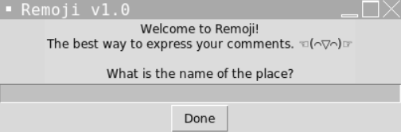

# remoji ☜(⌒▽⌒)☞
a reviewing system where the user expresses their satisfaction level based on kaomojis (japanese emoticons)

whether you feel satisfied ﾉ◕ヮ◕)ﾉ*:・ﾟ✧ or disappointed ಥ﹏ಥ remoji captures your emotions with one click! here are the review options:

### REVIEW OPTIONS: 
- (ﾉ◕ヮ◕)ﾉ*:・ﾟ✧ → Excellent!
- <(^_^)> → Nice
- ☉ ‿ ⚆ → Good
- ( 0 _ 0 ) → Mid
- ಠ_ಠ → Not Good
- ಥ﹏ಥ → Atroscious

